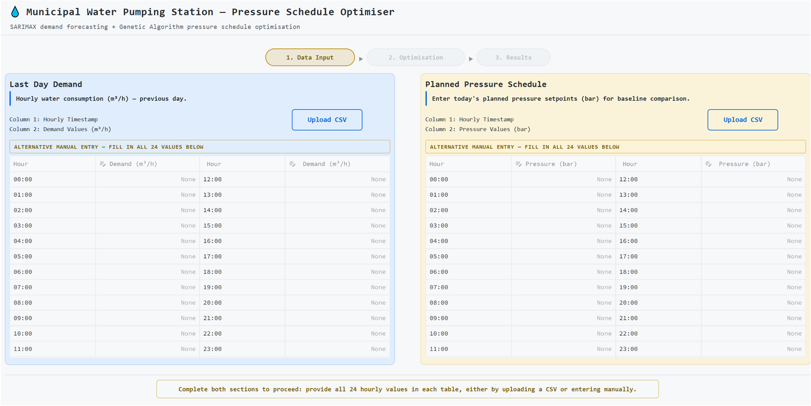
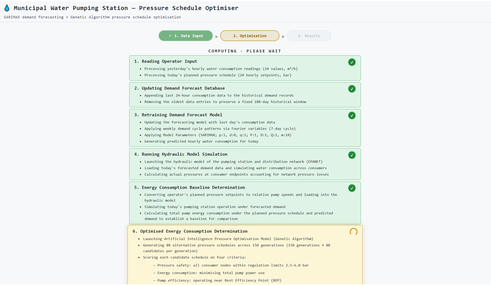
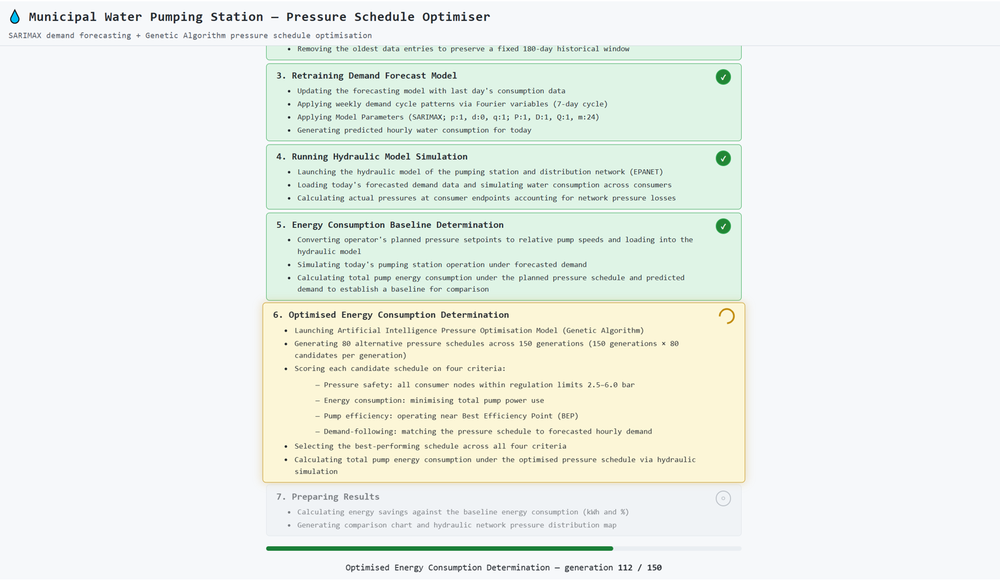
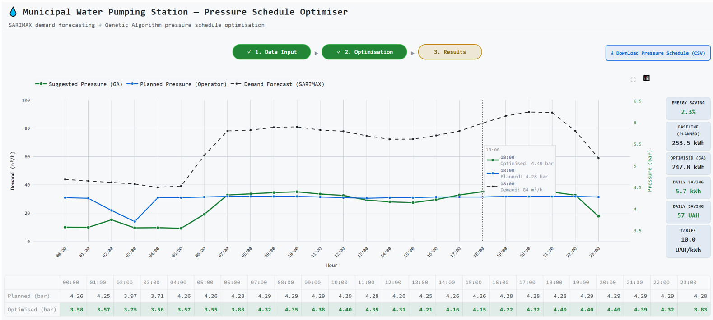
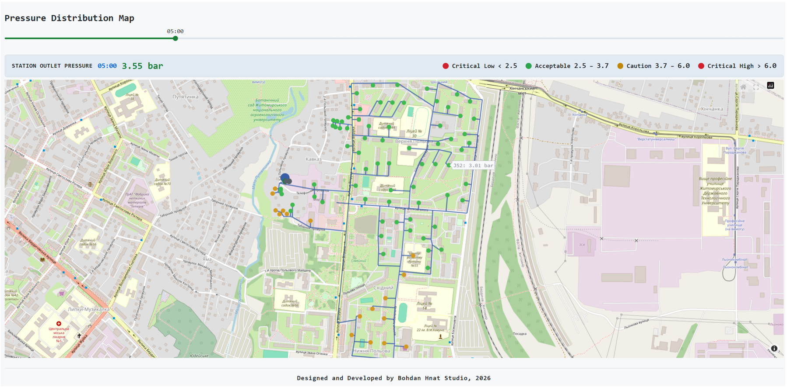

# Municipal Water Pumping Station — Pressure Schedule Optimiser

An AI-driven decision-support dashboard for the operators of a municipal water pumping station (the Vitruka station, Zhytomyr, Ukraine). The system forecasts the next 24 hours of water demand, then uses a genetic algorithm together with an EPANET hydraulic model based on real-world station topology to suggest an hourly outlet-pressure schedule that consumes less pump energy than the operator's own plan, while maintaining pressure at consumer buildings in the supply network within regulatory pressure limits of **2.5 – 6.0** bar (Government of Ukraine, DBN, 2013).

The operator stays in control: the dashboard *suggests* a schedule and quantifies the saving; it does not implement decisions on its own. In the validated demonstration scenario the optimiser achieves an energy saving of ≈**2.3** % relative to the operator's planned schedule.

Built with Python and Streamlit. Developed as the artefact of an AQA Extended Project Qualification (EPQ Project).

## Functionality

The operator provides two inputs on the **Data Input** page:

1. **Last Day Demand** — yesterday's hourly water consumption (24 values, m³/h), uploaded as a CSV or manually entered into the table.
2. **Planned Pressure Schedule** — the outlet pressure the operator intends to set for each hour of the current day (24 values, bar), via CSV upload or manual entry.

Pressing **Optimisation**, which becomes available once the data input is completed, launches a seven-stage pipeline, shown live on the **Optimisation Progress** page:

| Stage | What happens |
|---|---|
| 1 | Read and validate the two operator inputs |
| 2 | Append yesterday's 24 hours to the 180-day (4,320-hour) rolling demand window |
| 3 | Fully retrain the SARIMAX forecasting model (p: 1; d: 0; q: 1; P: 1; D: 1; Q: 1; m: 24; weekly-cycle Fourier exogenous variables) and forecast today's hourly demand |
| 4 | Load the EPANET model of the pumping station and distribution network (224 junctions, including 88 consumer nodes and two pumps) |
| 5 | Simulate the operator's planned schedule under the demand forecast, compute baseline energy consumption over 24 hours (kWh) |
| 6 | Run a single-objective genetic algorithm (80 candidates × 150 generations) that searches hourly outlet-pressure schedules, evaluating the fitness of candidate schedules based on their energy use, pump efficiency (deviation from Best Efficiency Point (BEP)) and how closely they follow the demand forecast curve, with consumer pressures within safe limits as a hard constraint |
| 7 | Simulate the best-performing across the fitness criteria schedule, compute the energy savings relative to operator baseline, and prepare the results display |

The **Results** page then shows:

- **Combined line graph** of the demand forecast, the operator's planned pressure and the GA-suggested pressure over the today's 24-hour period;
- Energy metrics of operator baseline and GA-optimised schedules: baseline consumption kWh, optimised consumption kWh, saving in kWh, % and UAH;
- Hourly planned-vs-optimised pressure **comparison table**;
- Interactive **pressure distribution map** of the network on OpenStreetMap background, with consumer nodes colour-coded by pressure (green, yellow, and red zones) at each hour and an hour slider;
- **Download CSV** button that exports the suggested outlet-pressure schedule as a CSV (24 values, bar) the operator can apply at the station.

## Screenshots

### 1 — Data Input


### 2 — Optimisation Progress #1


### 3 — Optimisation Progress #2


### 4 — Results: comparison chart and energy metrics


### 5 — Results: pressure distribution map


## Testing

This release is a **demonstration prototype frozen at a fixed historical date**. In the current version of the system, the SARIMAX training window ends on 28 January 2026, and the dashboard is designed to be driven by the matching demo input files included in this repository:

| File | Location in this repo | Upload into |
|---|---|---|
| `01-29_Operational_Demand.csv` | `demo_inputs/` | **Last Day Demand** section |
| `Planned_Pressure.csv` | `demo_inputs/` | **Planned Pressure Schedule** section |

**Steps:**

1. Download the two CSV files above from the `demo_inputs/` folder.
2. Open the dashboard (live demo link below).
3. On the opening data input page, upload `01-29_Operational_Demand.csv` into the left (*Last Day Demand*) section and `Planned_Pressure.csv` into the right (*Planned Pressure Schedule*) section.
4. When both sections show confirmation, press **2. Optimisation** in the top bar and wait - a full optimisation pipeline run (SARIMAX retraining + GA + hydraulic simulations) takes several minutes.
5. Review the results on the final page displayed automatically and download the suggested pressure schedule.

> **Input format.** Each CSV must contain exactly 24 rows and two columns: an hourly timestamp in column 1 and the value (m³/h or bar) in column 2. Values can alternatively be typed into the manual-entry tables. In this demo version the pipeline is calibrated to the 29 January 2026 dataset; arbitrary dates or other stations are out of scope for this release.

Two further data files are **built into the deployment** (the user does not upload them) and are included in the repository for inspection:

- `networks/Vitruka_Model.inp` — the EPANET 2.2 hydraulic model of the real-world station and its distribution network, used in the optimisation workflow;
- `data_files/SARIMAX_Historical_Window.csv` — the rolling historical demand window (Aug 2025 – Jan 2026) on which the forecasting model is retrained in the optimisation workflow.

**Live demo:** https://pressure-schedule-optimiser.streamlit.app

## Repository layout

```
app.py                     Streamlit entry point: views, navigation, session state
config.py                  All constants and file paths
core/
  pipeline.py              Seven-stage orchestration; PipelineResult container
  optimisation.py          GA problem definition, fitness components, EPANET helpers
utils/
  data_input.py            CSV upload / manual-entry widgets for both inputs
  rolling_window.py        Rolling-window update, SARIMAX retraining, 24 h forecast
ui/
  charts.py                Demand-and-pressure comparison chart (Plotly)
  pressure_map.py          Network pressure map on OpenStreetMap background (Plotly)
static/styles/             Dashboard CSS
networks/Vitruka_Model.inp EPANET model (built into the app)
data_files/                SARIMAX historical window (built into the app)
demo_inputs/               Demo CSVs to download and upload into the dashboard
```

## Tech stack

Python · Streamlit · EPANET 2.2 via wntr · statsmodels (SARIMAX) · pmdarima · pymoo (genetic algorithm) · pandas / NumPy · scikit-learn · Plotly · pydeck · Altair · seaborn · NetworkX
## Scope and limitations

- Demonstration prototype: not connected to live SCADA; the forecast window and demo inputs are frozen at a historical date so that every user reproduces the same validated run.
- The EPANET model is a skeletonised representation of the real network; reported figures are indicative for the demonstration scenario.
- Energy savings are computed against the operator's planned schedule simulated under the same demand forecast, so both schedules are compared on identical terms.
- Fixed placeholder cost parameters (a 10 UAH/kWh tariff and 365-day scaling) used to demonstrate energy-to-cost conversion of the energy savings, and any resulting monetary values are illustrative only and not financially validated.
- Real consumer addresses were used only to define the supply zone and then replaced with EPANET junction codes; the pressure map retains a real geographic background for operator context, and all outputs are explicitly model-based rather than real-time data.
